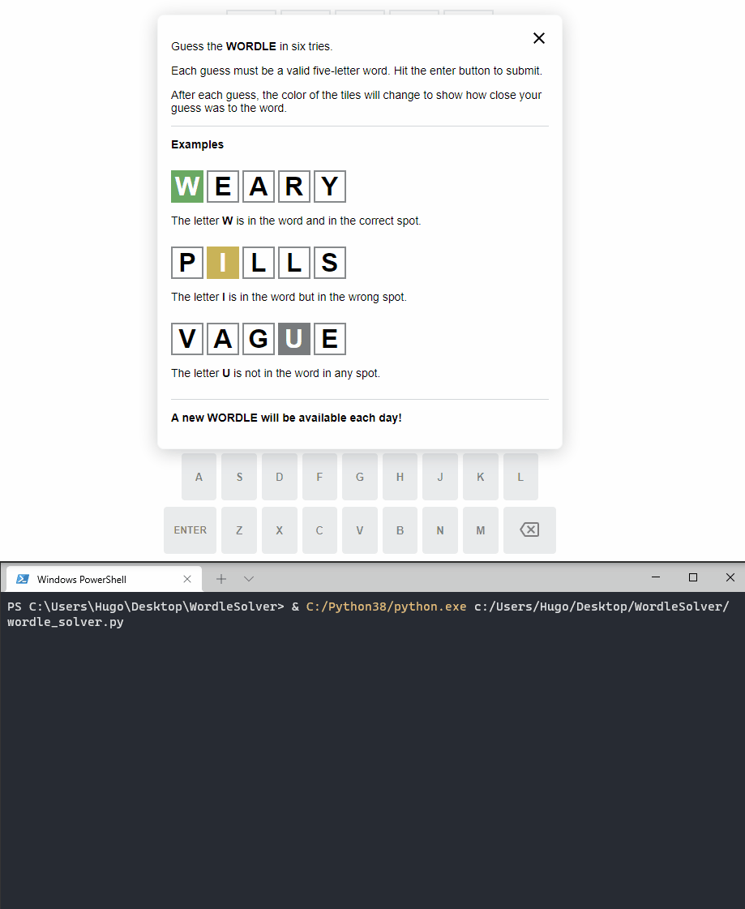

# Wordle Solver 🎓

 
This script automatically solves [Wordle](https://www.nytimes.com/games/wordle/index.html) puzzles usually within 3 or 4 attempts, depending on the first word given.

The  method it uses picks a word by calculating the weighted average using the remaining letters in the string that have not been either present or correct. Doing so will guarantee that the selected word will provide the most information possible by getting as many unused letters onto the board while keeping the ones that have landed. In this way, the pool of remaining potential words becomes narrowed even further.



## Requirements
- [Python](https://www.python.org/downloads/)
- [Selenium](https://chromedriver.chromium.org/downloads)

## Setup 
1. Create root folder
2. cd to root folder
4. Clone this repo
5. Open terminal and enter ``` cd Wordle-Solver ```

### Variables
At the top of the python file, you can change the following variables:

- ``` first_word = "<enter desired word>" ``` First word that the script guesses with.

- ``` open_with_chrome_profile = <True/False> ``` If set to True, it will open the Chrome browser with your default profile. Note that all Chrome instances will have to be closed if this option is used.
If False, it will open it in an anonymous webdriver profile.


## Usage
Enter ``` & path/to/python.exe path/to/wordle_solver.py ``` in terminal

